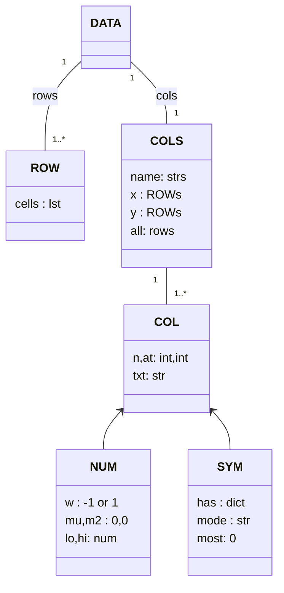

# Data

## How TESTED stores DATA


A repeated structure in my code are the following classes:


|class | notes |
|------|-------|
|NUM   | summarize stream of numbers|
|SYM   | summarize stream of symbols|
|ROW | container for one record |
|COLS  | factory for createing NUMs and SYms|
|DATA | container for ROWs, summaized into NUMs or SSYMs|


Conceptually there is a sixth class that is a super class
of NUM and SYM... but I don't actually implement that.

My CSV parser generates theses instances from data where row1 is some column headers 
and the other rows are the actual data.
```
Clndrs,Volume, HpX,  Lbs-,  Acc+,  Model, origin, Mpg+
4,      97,     52,  2130,  24.6,  82,    2,      40
4,      97,     54,  2254,  23.5,  72,    2,      20
4,      97,     78,  2188,  15.8,  80,    2,      30
4,     151,     90,  2950,  17.3,  82,    1,      30
6,     200,     ?,   2875,  17,    74,    1,      20
6,     146,     97,  2815,  14.5,  77,    3,      20
8,     267,    125,  3605,  15,    79,    1,      20
8,     307,    130,  4098,  14,    72,    1,      10
```
In these names:
- we skip columns whose names end in `X`;
- if the name starts in uppercase, we have a number
- if the name ends with "-" or "+" then its a goal we want to minimize or maximize
  - and for such items, we will set "w" to 1.


```
list of names      call                 weight    goal?
--------------     ----------------     ------    -----


{ "Clndrs",        NUM(1, "Clndrs")     1         n
  "Volume",        NUM(2, "Volume")     1         n
  "HpX",           NUM(3, "HpX")        1         n
  "Lbs-",          NUM(4, "Lbs-")         -1         y
  "Acc+",          NUM(5, "Acc+")       1            y
  "Model",         NUM(6, "Model")      1         n
  "origin",        SYM(7, "origin")               n
  "Mpg+"}          NUM(8, "Mgp+")       1            y
```
So the these CSV first line gets processed by a factory
that generates a set of goals `i.y` and other columns `i.x`:
```lua
COLS=obj"COLS"
function COLS.new(i,t,     col,cols)
  i.names, i.all, i.x, i.y = t, {}, {}, {}
  for n,s in pairs(t) do  -- like PYTHONS's for n,s in enumerate(t) do..
    col = s:find"^[A-Z]+" and NUM(n,s) or SYM(n,s)
    push(i.all, col)
    if not s:find"X$" then
      push(s:find"[!+-]$" and i.y or i.x, col) end end end
```
## DATA, ROW, COLS





In the above, DATA is the ringmaster that controls eigjt special cases:


- DATA is loaded from either 
  - a disc csv file [1]
  - rows from some other source  [2]
- When receiving new data, that data could be
  - a simple list [3]
  - a ROW (which is a container for a list) [4]
- When that data arrives, it is either
  -the first row (with the column names) [5]
  - or it is all other other rows of data. [6]
- When we work with data, we can either share the same ROWs [7] (e.g.
  if we are recursively cluster the same data) 
  or make new rows each time [8].

```lua
function ROW.new(i,t) i.cells=t; i.yseen=false end


function DATA.new(i,src,     fun)
  i.rows, i.cols = {}, nil
  fun = function(x) i:add(x) end
  if type(src) == "string" then csv(src,fun)  -- [1] load from a csv file on disk
                           else map(src or {}, fun)  -- [2] load from a list
                           end end
  
function DATA.add(i,t)
  if   i.cols          -- [6] true if we have already seen the column names
  then t = t.cells and t or ROW(t) -- [3][4][7]
       -- t =ROW(t.cells and t.cells or t) -- [3][4][8] "t" can be a ROW or a simple list
       push(i.rows, t) -- add new data to "i.rows"
       i.cols:adds(t)  -- update the summary information in "ic.ols"
  else i.cols=COLS(t)  -- [5] here, we create "i.cols" from the first row
       end end
```
Note that adding something to DATA means also updating the column summaries:
```lua
function COLS.add(i,row)
  for _,t in pairs({i.x,i.y}) do -- update all the columns we are no skipping
    for _,col in pairs(t) do
      col:add(row.cells[col.at]) end end end
```
One thing we can do here is  create a new table with the identical structure. 
```lua
function DATA.clone(i,  init,     data)
  data=DATA({i.cols.names})
  map(init or {}, function(x) data:add(x) end)
  return data end
```
## SYM


When a DATA instance stores some rows,
those rows are summarized in NUM or SYM instances. Note that:
 NUM and SYM all have:
 - an `add` method (for updating stuff) and
 -  a `mid` method for reporting central tendancy (mid=middle)
- a `div` methods for reporting the diversion around that center (div=diversity)


```lua
local SYM = lib.obj"SYM"
function SYM:new() --> SYM; constructor
  self.n   = 0
  self.has = {}
  self.most, self.mode = 0,nil end


function SYM:add(x) --> nil;  update counts of things seen so far
  if x ~= "?" then
   self.n = self.n + 1
   self.has[x] = 1 + (self.has[x] or 0) -- if "x" not seen before, init counter to 0
   if self.has[x] > self.most then
     self.most,self.mode = self.has[x], x end end end


function SYM:mid(x) --> n; return the mode
  return self.mode end


function SYM:div(x) --> n; return the entropy
  local function fun(p) return p*math.log(p,2) end
  local e=0; for _,n in pairs(self.has) do e = e - fun(n/self.n) end
  return e end
```


By the way, to understand SYM.div (entropy), think of it as
- the effort required by binary chop to find clumps of a signal hiding in a stream of noise
- and the more diverse the distribution, the greater that effort.

e.g. in a vector of size 4,
  - nazis have a "1" near one end
  - and England are all the other bits
- This means that 1/4% of the time we need to do binary chops to find nazies (i.e. $p_{\mathit{nazis}}=.25$)
- and 75% if the time we need to binary chops to find Englad (i.e. $p_{\mathit{england}}$=.75)
- Each chop will cost us $log2(p_i)$ so the total effort is $e=-\sum_i(p_i\times log_2(p_i))$ 
  - By convention, we  add a minus sign at the front (else all entropies will be negative).


(Actually, formally entropy has other definition: 
- The entropy of a discrete random variable is a lower bound on the expected number of bits required to transfer the result of the random variable.
- Also, entropy of continuous distributions is defined, but we do not use that in this subject.)


## NUM
```lua
local NUM = lib.obj"NUM"
function NUM:new() --> NUM;  constructor;
  self.n, self.mu, self.m2 = 0, 0, 0
  self.lo, self.hi = math.huge, -math.huge end


function NUM:add(n) --> NUM; add `n`, update min,max,standard deviation
  if n ~= "?" then
    self.n  = self.n + 1
    local d = n - self.mu
    self.mu = self.mu + d/self.n
    self.m2 = self.m2 + d*(n - self.mu)
    self.sd = (self.m2 <0 or self.n < 2) and 0 or (self.m2/(self.n-1))^0.5
    self.lo = math.min(n, self.lo)
    self.hi = math.max(n, self.hi) end end


function NUM:mid(x) return self.mu end --> n; return mean
function NUM:div(x) return self.sd end --> n; return standard deviation
```
If we are talking standard deviation, then we had better talk about normal curves.


The French mathematician Abraham de Moivre [^deMo1718]
  notes that probabilities associated with discretely 
  generated random variables (such as are obtained by flipping a coin or rolling a die) can 
  be approximated by the area under the graph of an exponential function.


This function was generalized by  Laplace[^Lap1812] 
  into the first central limit theorem, which proved that probabilities for almost 
  all independent and identically distributed random variables converge rapidly 
  (with sample size) to the area under an exponential function—that is, to a normal 
  distribution.

